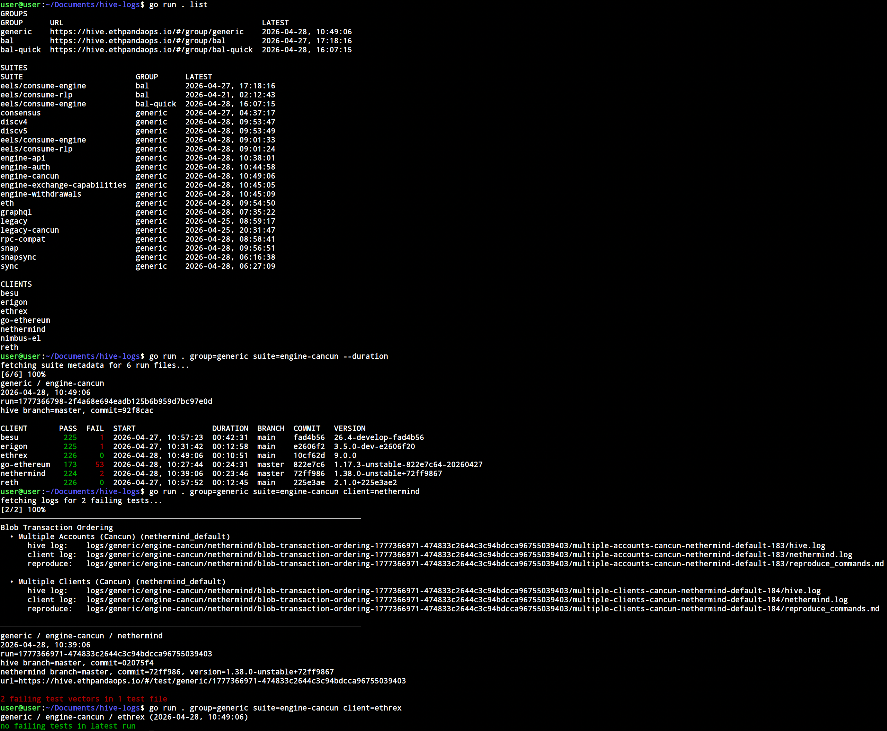

# hive-logs



`hive-logs` is a direct CLI for the public EthPandaOps Hive result site.
It exists to make two workflows easy:

1. **Get an overview** of the latest Hive test results for your client across
   groups and simulators — pass/fail counts, run metadata, and which tests
   are failing.
2. **Fetch the failing tests** of a specific simulator+client locally so an
   LLM (or you) can analyze the failure reasons. Each failing test is saved
   as a self-contained bundle of logs and metadata under `./logs`, ready to
   hand to a code agent.

The tool uses the static layout served by `https://hive.ethpandaops.io`:
`discovery.json`, `<group>/listing.jsonl`, `<group>/results/<suite>.json`, and
range requests for log files.

## Build

```sh
go build ./...
```

## Examples

Print version:

```sh
go run . --version
```

List groups, suites, and known clients:

```sh
go run . list
```

Show the latest run for each suite/client in a group:

```sh
go run . group=generic
```

Add `--all` when you want to include older runs, then add `--files` to print
file names. Add `--limit N` when you want to cap the number of rows printed.

Show per-client pass/fail counts for the latest run of a simulator:

```sh
go run . group=generic suite=engine-api
```

List failing tests for a client in the latest matching run and fetch all failure
bundles into `./logs`:

```sh
go run . group=generic suite=eels/consume-engine client=go-ethereum
```

By default the output groups failing test vectors under their test file (without
the per-vector log paths), e.g.:

```text
tests/shanghai/eip4895_withdrawals/test_withdrawals.py
  • test_large_amount[fork_Shanghai-blockchain_test]-go-ethereum_default
  • TestMultipleWithdrawalsSameAddress::test_multiple_withdrawals_same_address[fork_Shanghai-blockchain_test-test_case_multiple_blocks]-go-ethereum_default
```

Pass `--show-log-paths` to also print the `hive log:`, `client log:`, and
`reproduce:` paths next to each test vector:

```sh
go run . group=generic suite=eels/consume-engine client=go-ethereum --show-log-paths
```

```text
tests/shanghai/eip4895_withdrawals/test_withdrawals.py
  • test_large_amount[fork_Shanghai-blockchain_test]-go-ethereum_default
      hive log:    logs/.../hive.log
      client log:  logs/.../go-ethereum.log
      reproduce:   logs/.../reproduce_commands.md
```

Each bundle contains:

- `summary.json`: run metadata, Hive command, versions, test id, and log offsets
- `hive.log`: Hive/simulator log slice for that test
- `client.log`: client log slice(s) for that test
- `reproduce_commands.md`: reproduction context and the Hive command
